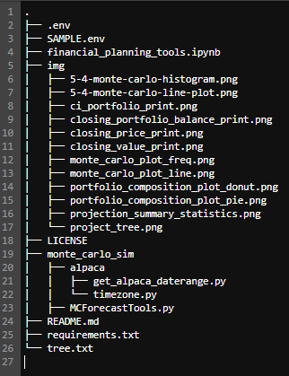
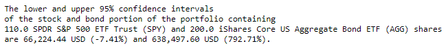

# <a id="Top-of-Page"> Welcome to the Financial Planning Tool!</a>
#### A tool for current valuation and predictive analysis of portfolio allocations.

***
## <a id="Contents">Cotents</a>
[Project Description](#Project-Description) 
[Technologies](#Technologies) 
[Installation Guide](#Installation-Guide) 
[Usage](#Usage) 
[Contributors](#Contributors) 
[License](#License) 
[Bottom of Page](#Bottom-of-Page) 

***
## <a id="Project-Description">Project Description</a>
This project provides up-to-date current portfolio analysis and future estimated projections.

#### A summary of what's under the hood:    
This project is composed of two main financial analysis tools:
1. **Emergencies:** A financial planner for emergencies. The members will be able to use this tool to visualize their current savings. The members can then determine if they have enough reserves for an emergency fund.  
2. **Retirment:** A financial planner for retirement. This tool will forecast the performance of their retirement portfolio in 30 and 10 years. To do this, the tool will make an Alpaca API call via the Alpaca SDK to get historical price data for use in Monte Carlo simulations. 

Using Jupyter notebook, this tool gathers current crypto and stock and bond for a user's portfolio. The modeled assets are:
 - Bitstamp and Coinbase (for crypto)
 - SPDR S&P 500 ETF Trust and iShares Core US Aggregate Bond ETF (for stock and bonds). 

The tool also models an average monthly household income of 12,000 USD. 

All historical information for crypto assets is collected from the <a href="https://alternative.me/crypto/api/" target="_blank">Free Crypto API</a>, and for the stock and bond assets we use the <a href="https://alpaca.markets/" target="_blank">Alpaca SDK</a>. 
#### Project layout:
The layout of essentials for this project is show below.

**Note:** <code>.env</code> is only a refernece to show how and where it should be in the project structure. Please use <code>SAMPLE.env</code> as a reference template for your own <code>.env</code> file.

***
## <a id="Technologies">Technologies</a>
<a href="https://docs.python.org/release/3.8.0/" title="https://docs.python.org/release/3.8.0/">

 
<a href="requirements.txt" title="requirements.txt">Requirements List</a>

***
## <a id="Installation-Guide">Installation Guide</a>
### Project Installation
To install <a href="https://github.com/jasonjgarcia24/financial-planning-tools" title="https://github.com/jasonjgarcia24/financial-planning-tools">financial-planning-tools</a>, type <code>git clone https://github.com/jasonjgarcia24/financial-planning-tools.git</code> into bash in your prefered local directory.  
Alternatively, you can navigate to the same address (<code>https://github.com/jasonjgarcia24/financial-planning-tools.git</code>) and download the full <code>main</code> branch's contents as a zip file to your prefered local directory. 

### Setting Environment Variables
A <code>.env</code> file is required for use with the <a href="https://alpaca.markets/" target="_blank">Alpaca SDK</a>. The Alpaca SDK will check the environment for a number of variables that can be used rather than hard-coding these into your scripts.

| Environment                        | Description           |
| ---------------------------------- | --------------------- |
| ALPACA_API_KEY=<key_id>            | Your API Key          |
| ALPACA_API_SECRET_KEY=<secret_key> | Your API Secret Key   |

***
## <a id="Usage">Usage</a>
### Inputs
Observe financial-planning-tools with <code>financial_planning_tools.ipynb</code>. No input variables are required if the default assets are used. 

### Outputs
This tool provides five main different expected types of textual outputs:
1. An asset's current closing price: 
 

2. An asset's current closing value: 
 

3. A portfolio's current closing value: 
 

4. A portfolio's proejcted valuation summary with confidence indices: 
 

5. A portfolio's projected valuation with confidence indices:
 

The tools also provides four different expected visualizations:
1. A pie chart summarizing the portfolio composition: 
 

2. A pie chart outlining the complete portfolio composition: 
 

3. A projection line chart from a Monte Carlo simulation: 
 

4. A projection distribution chart from a Monte Carlo simulation: 

***
## <a id="Contributors">Contributors</a>
Currently just me :) 

***
## <a id="License">License</a>
Each file included in this repository is licensed under the <a href="https://github.com/jasonjgarcia24/financial-planning-tools/blob/main/LICENSE" title="github.com/jasonjgarcia24/financial-planning-tools/blob/main/LICENSE">MIT License.</a>

***
[Top of Page](#Top-of-Page) 
[Contents](#Contents) 
[Project Description](#Project-Description) 
[Technologies](#Technologies) 
[Installation Guide](#Installation-Guide) 
[Usage](#Usage) 
[Contributors](#Contributors) 
[License](#License) 

